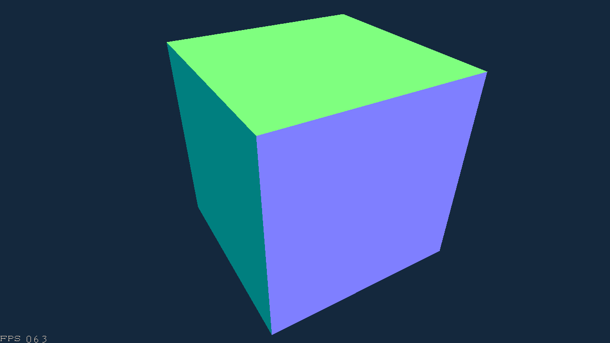
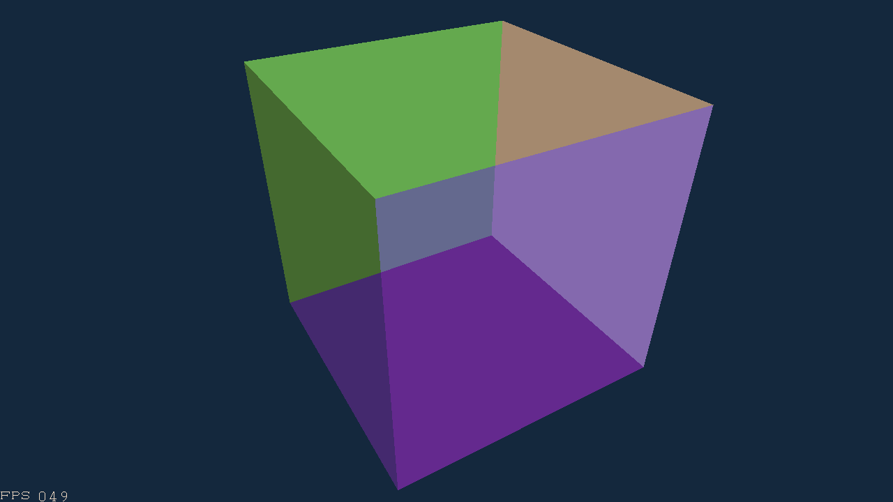
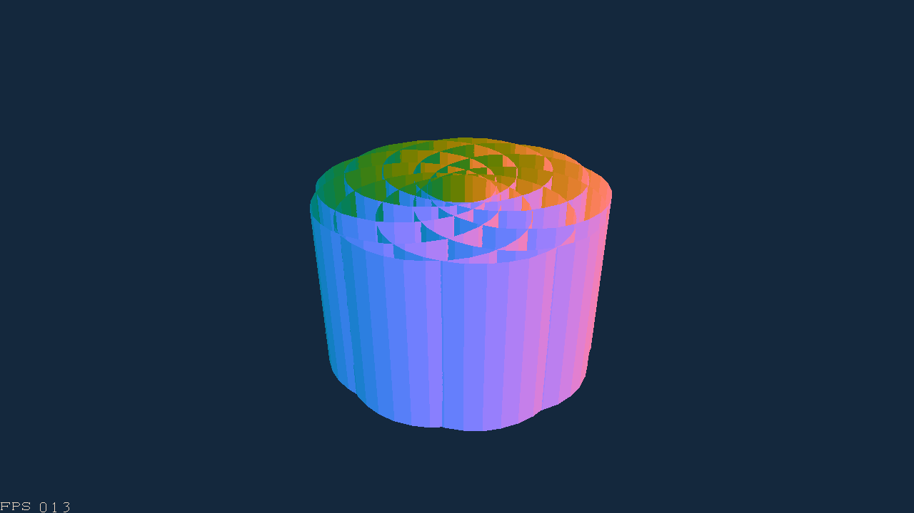
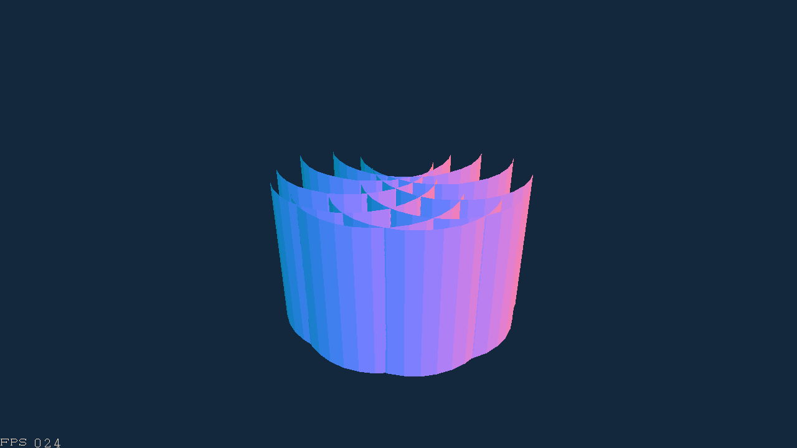
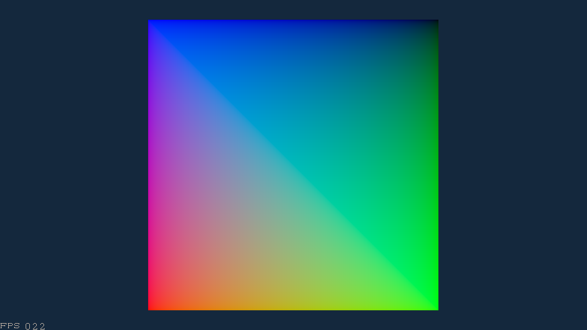
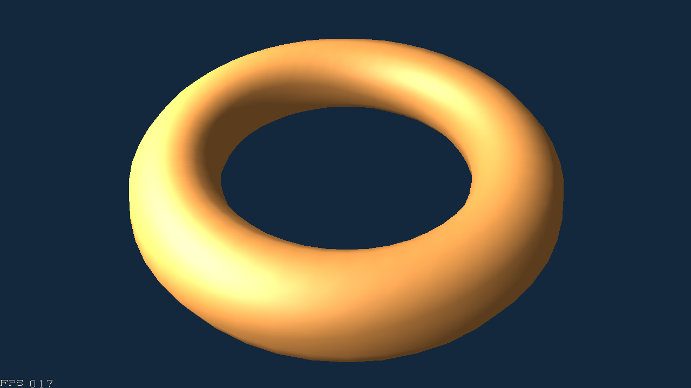
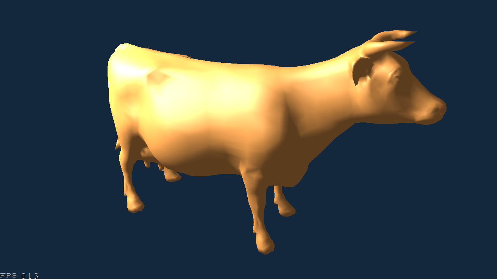
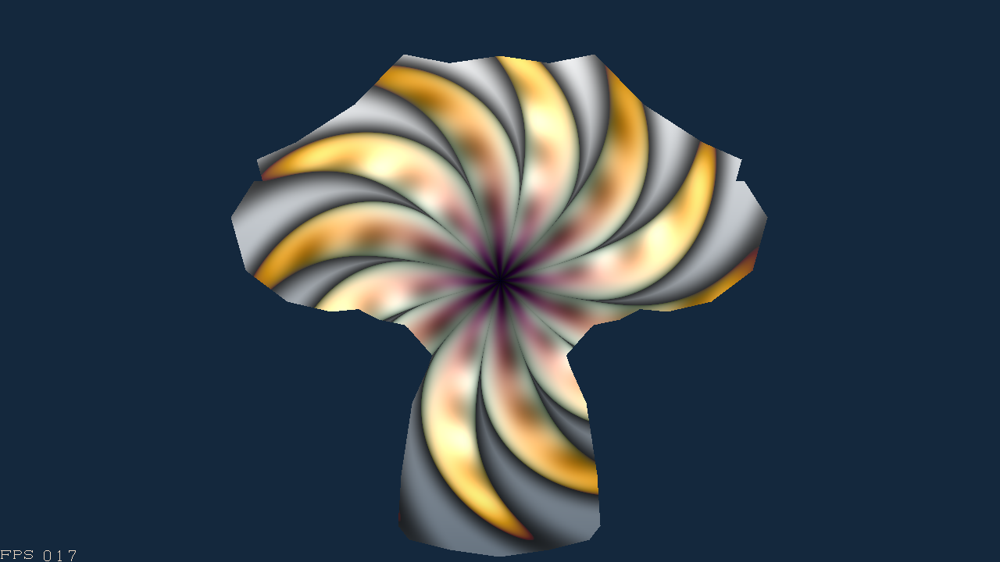

# cpupix

A CPU rasterizer.

The details will be listed...

# Results

* penetration

* depth test and blending

* face culling

* Gamma correction

* texture

* lighting, Phong / Blinn-Phong shading

* AA

No AA

SSAA

* Shadertoy

* Large number of faces

bunny, 69451 faces, 16-17 FPS

sponza, 279105 faces, 4 FPS

More image results and some video results can be found in the `result` directory.
